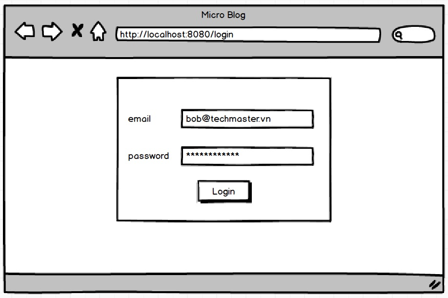
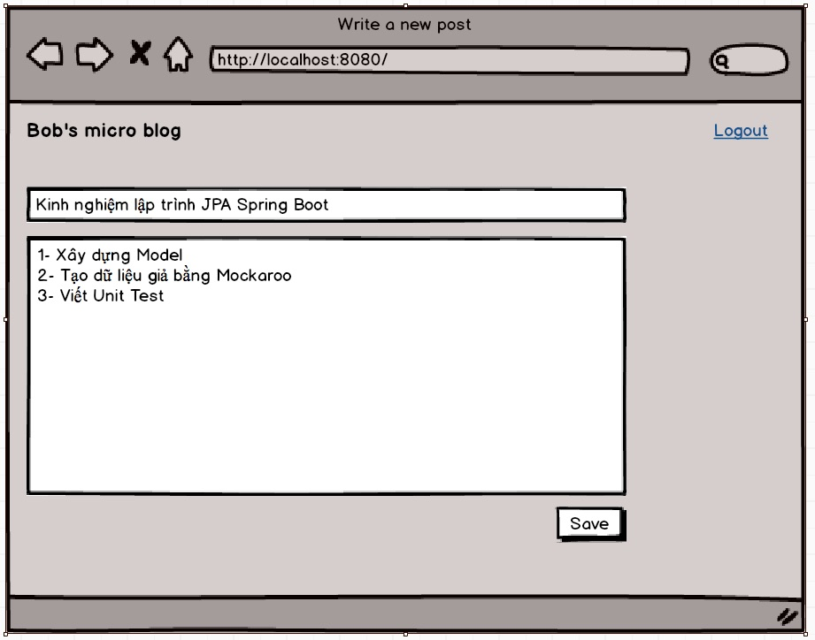
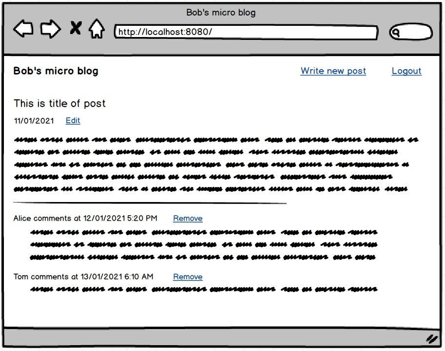
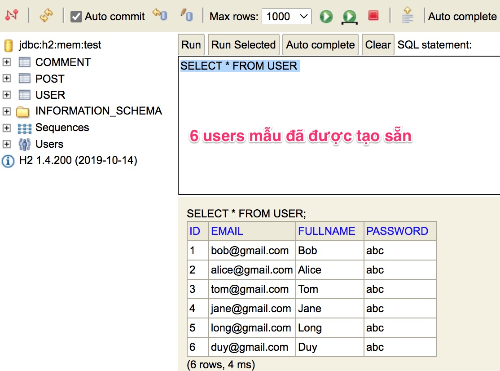

# User's Guide
1. run the app
2. access at [http://localhost:8080](http://localhost:8080)  
3. login using 1 out of 6 available accounts in [user.sql](src/main/resources/user.sql)  
   

# Ứng dụng Micro Blog

## Yêu cầu

**Bắt buộc**

Đúng và đủ chức năng:
- Login
- CRUD Post
- Create - Delete Comment (một user có thể comment post của người khác và chỉ có thể xóa comment của mình viết)

## Mockup giao diện

## Quan hệ giữa các bảng
- One user writes many posts
- One user writes many comments
- One post can receive many comments

## Dữ liệu mẫu có sẵn
6 users mẫu với password là 'abc' đã được nạp sẵn từ file [user.sql](src/main/resources/user.sql)

